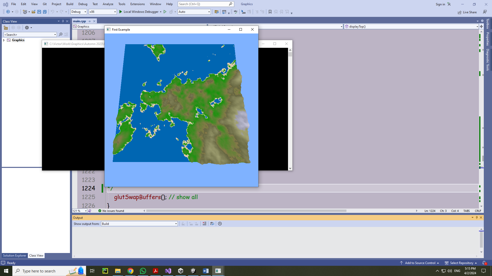
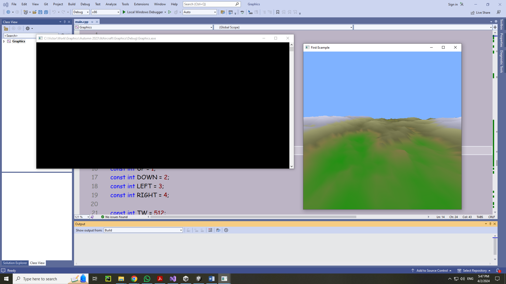
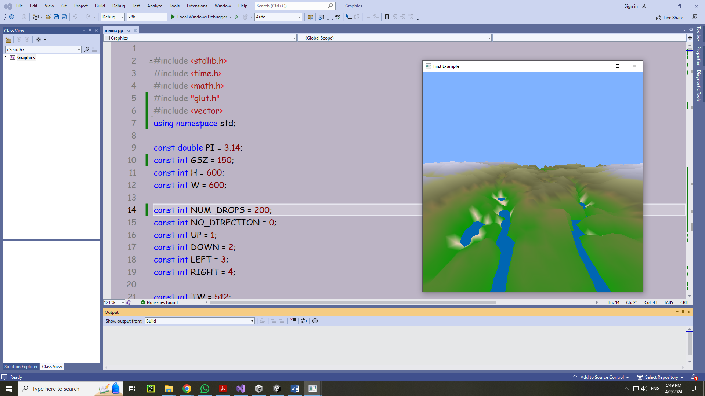
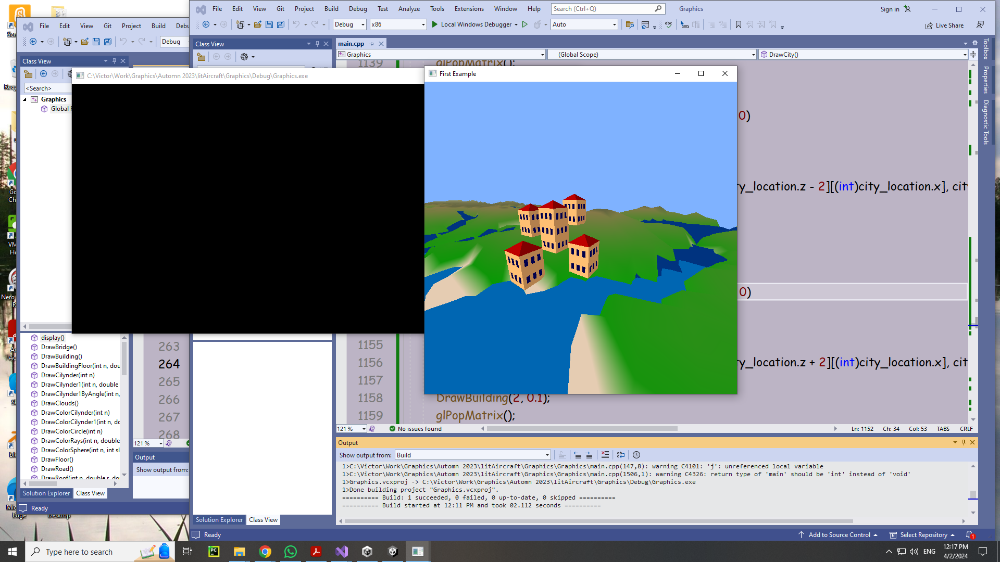

# OpenGL Graphics Project - River and City Simulation

## Overview
This project implements an OpenGL-based graphical simulation that expands upon a pre-existing random world environment. The simulation adds rivers, demonstrates hydraulic erosion, and identifies a suitable location for building a city near a river's mouth.

## Features
1. **Hydraulic Erosion Simulation**:
   - Raindrops randomly fall and flow downhill, eroding the terrain.
   - Droplets gather into streams, significantly affecting the terrain height.
   - Puddles form in areas surrounded by higher terrain, where evaporation occurs.

2. **River Rendering**:
   - Rivers flow at heights above zero and are visually distinct from seas or lakes.
   - Terrain is colored dynamically to reflect changes caused by erosion and water flow.

3. **City Placement**:
   - Identifies a suitable location for a city near a river mouth.
   - Ensures the city is on land, close to water, and above water level.
   - Utilizes a modified Flood Fill algorithm to locate the ideal area.

4. **City Construction**:
   - Adds buildings using a right-click.
   - Buildings are positioned dynamically based on the terrain and conditions.

5. **Interactive Controls**:
   - Start/stop hydraulic erosion using a left mouse click.
   - Move the camera view using the keyboard arrow keys (e.g., move backward, forward, etc.).
   - Add buildings by right-clicking on the terrain.

## Development Steps
1. **Terrain Generation**:
   - Based on a random world generated in class.
   - Displays an overhead view of the terrain.

2. **Hydraulic Erosion**:
   - Implements raindrop-based erosion, considering:
     - Downhill flow.
     - Erosion intensity proportional to stream size.
     - Evaporation effects on trapped water.

3. **Water Coloring**:
   - Highlights rivers, lakes, and seas with distinct colors.
   - Water emerges as terrain erodes below the water level.

4. **City Placement Logic**:
   - Checks for conditions:
     - Terrain height above 0.
     - Proximity to rivers or lakes.
     - Land adjacent to water.
   - Uses Flood Fill to locate an area meeting all criteria.

5. **City Construction**:
   - Adds buildings dynamically using mouse input (right-click).

## Screenshots

### Map

### Initial Terrain

### Terrain After Hydraulic Erosion

### River Coloring and City Placement

## Instructions
### Prerequisites
- Visual Studio 2022
- OpenGL libraries installed and configured.

### How to Run
1. Clone the repository or download the source code.
2. Open the project in Visual Studio 2022.
3. Build the solution to compile the project.
4. Run the project to see the simulation in action.

### Controls
- **Left Mouse Click**: Start/stop hydraulic erosion.
- **Right Mouse Click**: Add buildings to the terrain.
- **Keyboard Arrow Keys**: Move the camera view (e.g., move backward, forward, etc.).
